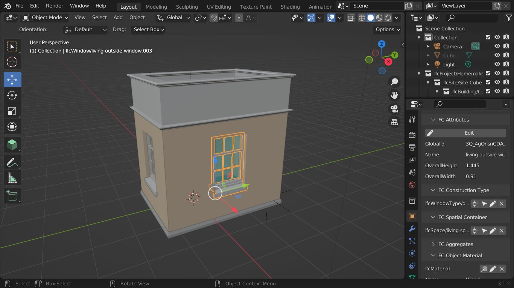
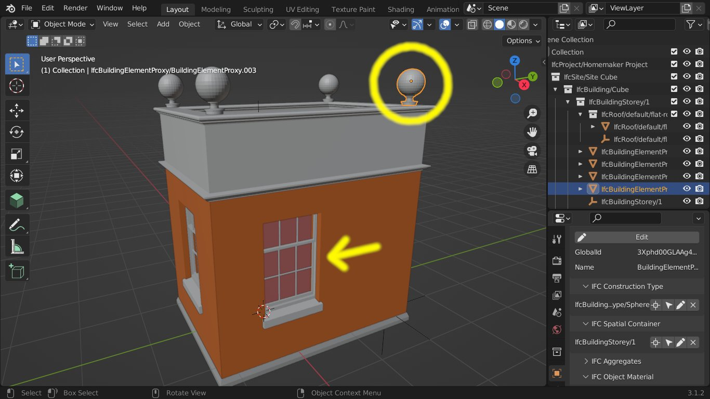
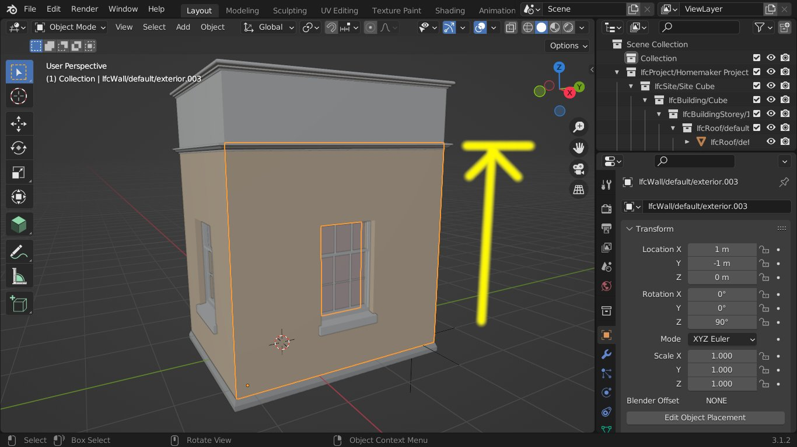
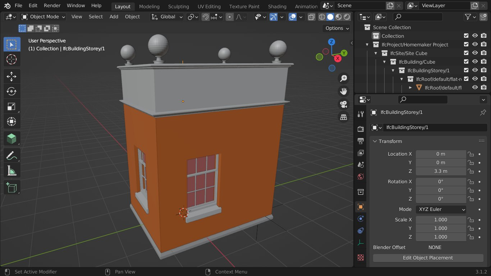

Native IFC
==========

*A white-paper introducing a collaborative BIM using open standards and open protocols*

[Note: this document is a work-in-progress, comments and contributions welcome]

Abstract
--------

A simple to implement set of protocols for reading and writing BIM data, known as *Native IFC*, enables robust multi-user collaborative BIM workflows.
We show how full version tracking, rollback, attribution, staging, merging, multi-user editing, issue tracking, automated checking, and publishing can be achieved by hosting IFC data in established commercial and open source git-forge services.
We show that the git revision control system as a Common Data Environment (CDE) for BIM data is scalable, secure, future-proof and fully interoperable with existing systems. 
We show multiple software applications and libraries that already implement *Native IFC*, this is a real-world technology.

Motivation
----------

Building Information Modelling (BIM) is a process of modelling entire buildings as things, information, and the relationships between them.

BIM is generally done with large software applications that keep their data in proprietary files.
These are shared in what is called a Common Data Environment (CDE), effectively a file server that can be accessed remotely.

This way of doing Collaborative BIM has disadvantages: one of them is that such a system can't be called interoperable without exporting data to open formats such as `Industry Foundation Classes (IFC)`_ and sharing these exported files; this in turn means that it isn't practical for multiple people to contribute to the same model without problematic workarounds.

A system where data is exported from one application and imported into another is a one-way street.
Round-tripping through import/export necessarily involves data loss, design teams therefore construct workflows so that round-tripping never happens.
Where multiple trades and consultants are involved in a project, typically each will be given strictly delimited parts of the project to work-on, making their parts available to the rest of the team as a read-only reference.
This division of labour is termed 'federation', where each trade owns a separate file, usually with the architectural part providing overall coordination
(A proprietary form of this, 'worksharing', allows this division of labour to occur within a single file, but it requires that all users are using the same proprietary application and file format).

Dividing work into fragments that can each only be edited by one person at a time creates bottlenecks.
In this situation, an architect can't work on the ground floor of a building while their colleague sat next to them works on the roof.

Separating trades into silos that can't modify each other's data has further disadvantages:
A structural engineer can't provisionally move a door in the architect's model; they have to create a sketch showing how they think the door should move, send it in an email to the architect, hoping then that the architect might update their model at some point - eventually this moved door will cascade into the federated model that everyone sees.
Another example, in a real-life construction project, buildings are never built exactly as-drawn; a responsible contractor will update a BIM model 'as-built', but these updates can't be fed-back upstream so that everybody has the same model, this would require import, update, export, import and export steps - overwriting the upstream models in the process.

In contrast, the way we write and maintain software is not at all like the way buildings are designed and managed with BIM.
Many software projects have lots of contributors, often working on the same files at the same time, using systems that scale to thousands of developers.

Software development has settled on a few collaborative practices and tools: we store our files in distributed systems like the `git version control system`_, and we work by 'forking' a copy, making local changes, then requesting that others 'pull' our changes, merging them with their own.

This collaborative software development wouldn't be possible without a specific technology: the *three-way merge*.
A 'three-way merge' allows two people to make independent changes to the same file, then merge them together using the common 'ancestor' as a base reference.

We assert that what the AEC community needs is the equivalent of a 'three-way merge' for BIM data.
Consequently, this whitepaper introduces a working three-way merge tool for *Native IFC* data.
This *Native IFC* workflow enables genuine interoperable distributed BIM collaboration, reusing tools long available in the software world: `git-forge services`_ such as GitHub, trackers, discussion, tagging, releases and continuous integration.

Rationale
---------

We propose a new paradigm, creating and editing IFC data in-place without import/export translation to proprietary models: *Native IFC*.

We note that *Native IFC* data in SPF (STEP Physical File) format is a good fit for storage in distributed Revision Control Systems such as *git* or *mercurial*.
*Native IFC* changesets are small, limited to just the modified, deleted or added data - a small change to a huge file represents a few bytes of data.
Git repositories contain full history, allowing design development to be reconstructed at any time.
Git is an open standard, repositories can be local, or hosted online in 'forges', and transferred elsewhere without loss of history.
Git scales, in 2017 the entire Microsoft `Windows code base moved to git`_ into a single 300 GigaByte repository.

We propose that multiple users should be able to work on BIM models asynchronously, updating using a three-way merge process.
However for a modern branch, fork, pull-request and merge workflow, the standard three-way merge approach used for software sourcecode simply doesn't work for IFC files.
This is because sourcecode is ordered by line, for each line of sourcecode the adjacent contextual lines are extremely relevant.
SPF files are ordered by numeric ID, each entity may appear anywhere in the file, but the unique ID is the key to accessing the entity.
We find that tracking of modified, deleted and added SPF IDs is sufficient to characterise the difference between two SPF files.
Further, tracking SPF IDs allows robust three-way merging of *Native IFC* files, enabling the collaborative branching/merging workflow described above.

This ability for multiple users to edit the same *Native IFC* file asynchronously changes the basic rationale for federated files within collaborative design projects.
Computer resources constrain the maximum practical size of individual IFC files, this constraint will primarily determine the number of files required in a federated BIM model consisting of *Native IFC* files.
In a small construction project it is possible, though not necessarily desirable, for all project stakeholders to work with a single *Native IFC* file.

BIM is not just objects and information, but relationships between this data.
With a federated model, defining a relationship between elements that exist in separate files is not straightforward.
For example, spatial containers such as rooms and storeys are typically defined in an architectural model, a federated building services model can't assign equipment to these spaces as a result.
*Native IFC* offers solutions to these sorts of problems by putting data where it is needed rather than where software constraints require it to be put.

`Git-forge services`_ typically have advanced issue tracking, discussion, repository management and automation via continuous integration.
These features potentially provide a complete replacement CDE (common data environment).
These Services can be self-hosted using Open Source forges such as `Gitea`_.
Commercial services such as `Github`_ offer guaranteed availability, advanced user management and access control for millions of existing users and organisations.

Continuous integration triggered by 'commit hooks' allows problems and status changes to be tracked and reported automatically.
Generation of documentation, 2D drawings, schedules etc.. from IFC models can potentially be automated and regenerated automatically for each tagged-release.
In the future, costings, carbon analysis, thermal, structural analysis, any number of other checks can all be performed for *every commit* - giving short feedback cycles needed when designing complex systems.

*Native IFC* is easy to compare, we envisage that web-viewers will soon be able to browse changes between arbitrary git revisions, previewing pull-requests and allowing project stakeholders access to the latest official BIM model, or even to watch work in progress.

Specification
-------------

A basic feature of *Native IFC* is that as long as simple rules are followed, multiple tools from multiple vendors can work on the same IFC data without conflict.

Technical requirements
~~~~~~~~~~~~~~~~~~~~~~

A *Native IFC* application behaves in the following ways when editing a pre-existing IFC (STEP/SPF) file:

1. IFC entities *must* be written in the same format as received, with the same numeric IDs as before.  Sorting the lines by numeric ID is *recommended*.

2. Attribute changes to entities *must* be written in-place, preserving the numeric ID of the entity.

3. Numeric IDs of deleted entities *must not* be reused for new entities.

General principles
~~~~~~~~~~~~~~~~~~

Data is not mangled during I/O, the IFC data is the source of truth.
This means that an application does not translate to internal data models and export back to IFC unless the user is modifying that bit of data.

Data is never lost outside the application scope: an application operation touches only the IFC subgraphs that is relevant to its function.
This means that there must be no 'side effects' or 'domino effects' of data loss by touching data in one spot.
E.g. editing an object attribute should not affect related materials, assigned tasks, or cost items.

Data is added without affecting existing data.

STEP/SPF IDs are critical to uniquely identify any little bit of IFC data.
So any non-STEP tool that used IFC GUIDs instead would need clear ways of navigating from rooted entities in order to map back and forth with ID preserving STEP repositories.

Data is modified in place where possible: things like attributes and properties can be modified in place.
However, there are some things that are ambiguous, like brep/tessellation shape representation subgraphs, which can be treated as 'trash and recreate' if they have been modified.
Though parametric extrusions and similar can be edited in-place, so they should.

Data is exposed through an application UI starting at rooted IFC entities.
The concept is that unless the *Native IFC* tool is some developer poweruser thing, the user should always be presented clearly with rooted entities as a starting point, which then access the auxiliary data.
This allows some level of sanity of exchanging data with the ability to think in terms of rooted entities.
There are some unfortunate exceptions to this, like materials and profiles which are critical to many disciplines but not given first class IFC status in the existing specification.

Description of an IFC three-way merge tool
------------------------------------------

A three-way merge tool requires a *base* file, a common-ancestor of the changed *local* and *remote* files.
The ``git merge`` command automatically finds this nearest *base* common-ancestor in the git repository, so you don't have to.

Merging analysis determines which STEP IDs have been modified, deleted or added between the *base* and the *local*, the same process is performed for differences between the *base* and *remote*.

If entities have been added to both the *local* and *remote* files, the locally added entities and any references to them are renumbered/incremented such that there are no duplicate IDs.
Added entities can then be merged into the *base* without conflict.

Deleted entities from either branch are removed from the *base*.
However entities that are deleted in one branch and modified in the other will cause the merge to be abandoned, this will need to be resolved manually before trying again.

Merges of software source code will fail badly if the same entity/line has been modified in both branches.
However, STEP entities are structured, with fixed count and ordering of attributes, so if different attributes have been modified in each branch, both changes can be transferred to the merged output.
This allows, for example, the Name and Representation of a Wall to be modified in respective branches without conflict.
Further, many entity attributes are just lists of STEP IDs; additions and deletions to these lists can also be merged.
This allows, for example, elements to be added to a Spatial zone or Aggregate in both branches.

This is a short description, but hopefully it illustrates that *Native IFC* files are considerably better suited to this three-way merge process than software source-code.
For further details, please refer to `ifcmerge`_, a reference implementation of a three-way merge tool for IFC/SPF data.

Backwards compatibility
-----------------------

Although *Native IFC* expects applications to take the steps described above to ensure file continuity, the files themselves are entirely normal standards-compliant IFC STEP files, which can still be imported by legacy applications.

A file maintained under *Native IFC* protocols can even be used within a legacy federated BIM collaboration setup, either as a read-only overlay imported into legacy tools, or using files exported by legacy tools as federated overlays. Such arrangements may last for the duration of multi-year construction projects without incurring additional administration costs.

*Native IFC* files are fully interoperable in any such `openBIM`_ scenario.

Security implications
---------------------

It is important to consider how a malicious actor could exploit any data protocol, such an attack could come from outside or inside a project team.

Confidentiality
~~~~~~~~~~~~~~~

There is a distinction between normal expectations of privacy of occupants and designers, and potential criminal attacks on the building itself using privileged information.
Most git-forge services allow fine-grained access control, including requiring multi-factor authentication for read-only access, so confidentiality is eminently achievable if required.
Git allows commits to be 'squashed' together before sharing, so evidence of wasted effort, corrected mistakes or weekend working does not have to shared with the rest of the design team.
We believe that the threat of burglary or terrorism from access to BIM data is overblown, these are 'movie-plot threats' that are only relevant in specialist contexts, ordinary buildings are just not that different from each other.
An analogy that can be drawn from software is that publically available and auditable software is generally considered positive for security.

Intellectual property
~~~~~~~~~~~~~~~~~~~~~

As above, git-forge access control can offer read-only restrictions.
With git, since the authorship of commits is recorded, it is possible to identify exactly the design ownership of models or part models.

A consideration is that there are advantages to allowing wider access to BIM models, some examples:
an active citizen may be entitled to examine publicly funded construction projects in detail;
sharing best-practice can improve the general quality of construction;
an unauthenticated public URL that links directly to a view of a model using `BIM Collaboration Format (BCF)`_ would greatly aid communication between stakeholders;
and, as with Open Source software, there are untapped benefits to adopting 'copyleft' licenses that allow reuse of design work. 

Auditing
~~~~~~~~

With git as a version control system, all changes to a model can be traced precisely to author and date committed, either by trusting the git-forge authentication system, or in extreme cases by adopting PGP or S/MIME signing of commits.

Reference Implementations
-------------------------

*Native IFC* is not an onerous standard.
From a software developers viewpoint, *Native IFC* is a rational design and implementation choice.
So we have identified independently developed tools written in languages as diverse as C++/Python, Javascript and Perl that implement the standard without requiring any further modification.
i.e. these tools already implement *Native IFC* by default:

`BlenderBIM`_, Python. Partially complete GUI IFC editing and authoring tool.

`IfcOpenShell`_, C++/Python. A Mature library for manipulating IFC data.

`IFC.js`_, Javascript. Work in progress library and web GUI.

`File::IFC`_, Perl. Legacy stable library for reading and writing IFC/SPF data.

Limitations
-----------

Although there are fully functional *Native IFC* tools that cover much of the requirements of the AEC industry, and an advantage of *Native IFC* is that multiple tools can be used simultaneously without conflict, GUI tools like `BlenderBIM`_ and `IFC.js`_ are currently under rapid development.
As a result, support for some AEC related tasks is mature, partial or missing entirely.

IFC is a low-level language with extensive functionality to describe how buildings are constructed, what they are made from, and how they work.
IFC doesn't generally describe *design intent* or *parametric behaviour*.
The typical solution to this to attach additional metadata to elements and aggregates of elements indicate how they may be recreated in a high-level process.
These extensions to the standard may be shared between applications or specific to a particular tool.
Any *Native IFC* tool will preserve the data in these extensions automatically, though without coordination it may become out of sync when objects are edited.

BIM projects are limited by the difficulty of handling large unwieldy files.
Federation (splitting projects up into multiple files) will always be necessary to deal with these limitations.
Survey scans and other received information is used entirely for reference, so there is no advantage to including such data in a design model, and considerable disadvantage.
Federation can be supported either as multiple files in a single repository, or using third-party repositories included as 'submodules', this way ownership may be distributed in a variety of ways as necessary to suit specific project needs.
*Native IFC* tools such as BlenderBIM allow 'filtered' opening of IFC files, so a user may choose to only load a subset of the model geometry in the GUI for editing, extending this subset as necessary when access is required for viewing and editing.
We envisage that this 'filtering', and further enhancements of it in combination with a federated approach will be required to work with very large BIM projects.

By rewriting entity IDs, the three-way merge process 'squashes' commits, obscuring any fine-grain distinction between them.
So any staging process, with multiple levels of approval involving pull-requests, will associate all changes with the most recent approver - these approvers will be responsible for including relevant authorship information in commit messages. 

Git forges have extensive issue tracking with easy to use discussion of pull requests, problems and general queries.
Although git repositories of data are easy to move and replicate, this forking behaviour being of course fundamental to the branch and merge workflow, these discussions are not so straightforward to move, potentially being lost at the end of a project.
This may not be a problem for particular projects, and currently git forges offer indefinite archiving, but to be certain that this communication is not lost, a self-hosted git forge such as `Gitea`_ may be preferred.

Rejected Ideas
--------------

Often offered as a solution is storing IFC data for a project in a single online relational or graph database.
This would allow synchronous access, preventing conflict through short-term and local-scope locking mechanisms.
We are not proposing this as a solution as it introduces a single point of failure.
A git based workflow is distributed and robust against network failure, gracefully falling-back to simple distribution methods such as email during network instability or server failure.

Illustration of IFC three-way merging
-------------------------------------

The following sequences show the resolution of situations where the same entity has been edited in both branches, merging of data manipulated by different applications, and scalability with large files.

Overlapping edits
~~~~~~~~~~~~~~~~~

   This is a *Native IFC* model of a simple building we are going to edit collaboratively.
   It is created in Blenderbim, but it could be any IFC file.

   This is the same model with some changes made in Blenderbim, a *Native IFC* editor.
   A window has been moved, the wall material has changed, and some decorative finials have been added to the roof storey.

   In parallel, in another branch, some different changes are made to the original model.
   The roof storey has been raised and the wall heights increased to match.
   At this point, we have two 'forks' of the design, both manipulating the same building elements.

   With a three-way merge, using the comon base of the two forked designs as a reference, we can combine the forks.
   All window and wall changes are preserved and the finials are moved with the roof storey.

Multiple applications
~~~~~~~~~~~~~~~~~~~~~

TODO

Large models
~~~~~~~~~~~~

TODO

About
-----

Copyright 2022, Bruno Postle with additional text by Dion Moult. The latest version of this document can be found at https://github.com/brunopostle/ifcmerge/blob/main/docs/whitepaper.rst

.. _git version control system: https://git-scm.com/

.. _git-forge services: https://en.m.wikipedia.org/wiki/Forge_(software)

.. _Windows code base moved to git: https://devblogs.microsoft.com/bharry/the-largest-git-repo-on-the-planet/

.. _Industry Foundation Classes (IFC): https://technical.buildingsmart.org/standards/ifc

.. _BIM Collaboration Format (BCF): https://technical.buildingsmart.org/standards/bcf/

.. _openBIM: https://www.buildingsmart.org/about/openbim/

.. _BlenderBIM: https://blenderbim.org

.. _IfcOpenShell: https://github.com/IfcOpenShell/IfcOpenShell

.. _IFC.js: https://github.com/IFCjs

.. _File::IFC: https://bitbucket.org/brunopostle/file-ifc

.. _ifcmerge: https://github.com/brunopostle/ifcmerge

.. _Gitea: https://gitea.io/

.. _Github: https://github.com/
